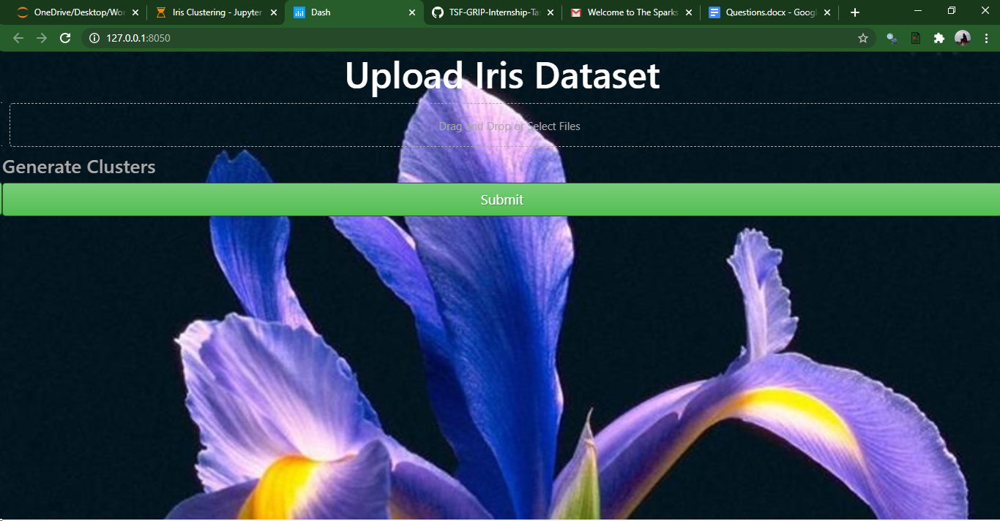
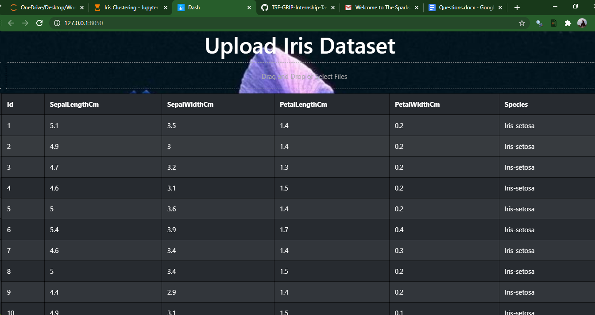
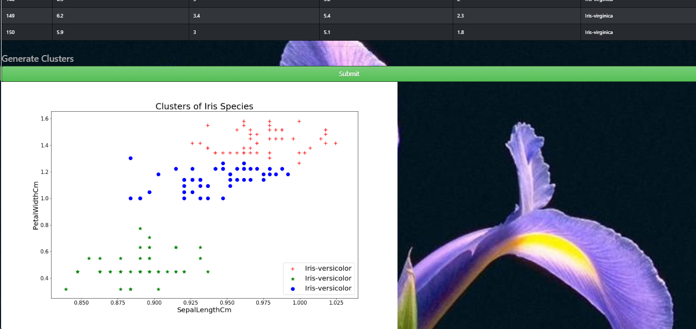

# Problem Statement :
Q2. (To Explore Unsupervised Machine Learning)
From the given ‘Iris’ dataset, predict the optimum number of clusters and represent it visually.
Dataset : https://drive.google.com/file/d/11Iq7YvbWZbt8VXjfm06brx66b10YiwK-/view?usp=sharing

# Tools and Library Used :
1. Jupyter Notebook.
2. Numpy.
3. MatplotLib
4. Sklearn
5. Seaborn
6. Plotly-Dash

# Outcome :

## Application UI

## Uploading the Iris Dataset

## Clusters Visualization (Output)

