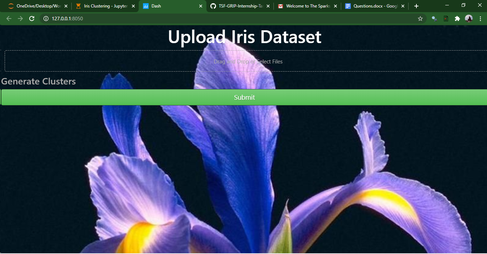

# TSF-GRIP-Internship-Tasks
The following repository has been created to showcase the tasks performed during the "The Sparks Foundation - Machine Learning /Data Science" Graduate Rotational Internship Program July-August 2020.

