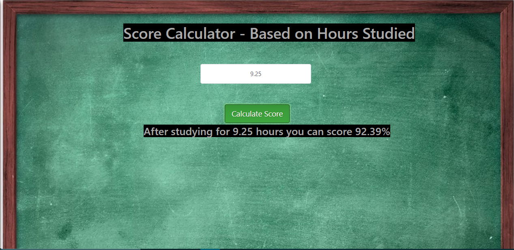
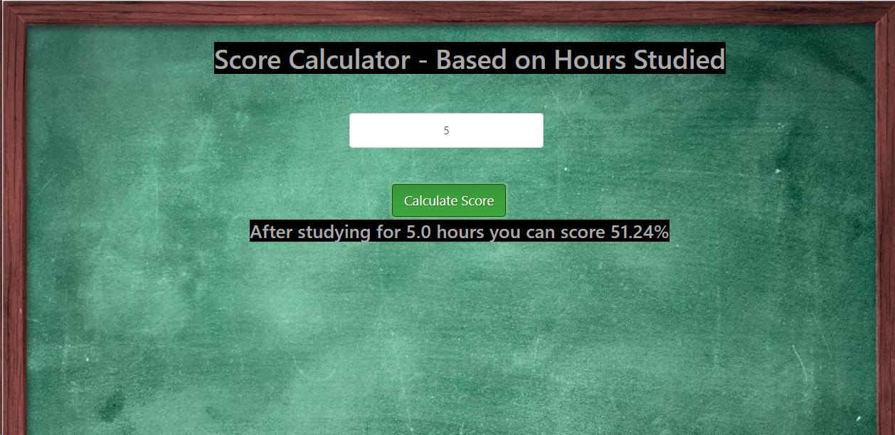

# PROBLEM STATEMENT
Q1. (To Explore Supervised Machine Learning)
In this regression task we will predict the percentage of marks that a student is expected to score based upon the number of hours they studied. This is a simple linear regression task as it involves just two variables. Data can be found at http://bit.ly/w-data
What will be predicted score if a student study for 9.25 hrs in a day? 

# Tools and Library Used.
1. Jupyter Notebook.
2. Numpy.
3. MatplotLib
4. Sklearn
5. Plotly-Dash

# Outcome -:
## Example 1 :
 
 ## Example 2 :
 
